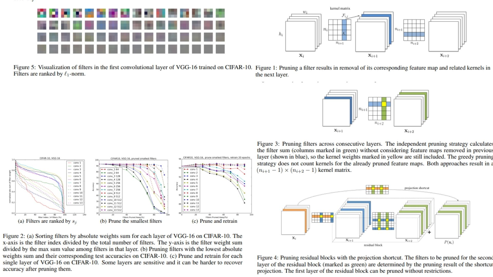

# 🪓 FilterPruning-Replication – Structured Filter Removal for Efficient ConvNets

This repository presents a **PyTorch-based replication** of  
**Pruning Filters for Efficient ConvNets** (ICLR 2017).
The goal is **not benchmarking accuracy**, but **faithfully translating the paper’s theoretical pruning logic into a clean, inspectable implementation**, without relying on data or full training loops.

- Filter importance measured via **L1-norm of convolutional kernels** ⟁  
- **Structured filter pruning** instead of unstructured sparsity ⟡  
- Architecture-aware pruning strategies (independent & greedy) ⟢  

**Paper reference:**  [Pruning Filters for Efficient ConvNets – Li et al., 2017](https://arxiv.org/abs/1608.08710) 🜄

---

## 🌗 Overview – Filter Pruning Pipeline



Core intuition:

> Filters with small weight magnitudes contribute weak feature maps and can be safely removed.

Condensed pipeline:

1. Start from a **predefined CNN architecture** (e.g. VGG-style or ResNet-style blocks).
2. For each convolutional layer, compute **filter importance scores** using L1-norm.
3. Rank filters and **prune the weakest ones** according to layer or stage sensitivity.
4. Physically remove:
   - the selected filters,
   - their output feature maps,
   - and the corresponding kernels in the next layer.
5. (Optional) Repeat pruning iteratively or retrain if desired.

The result is a **smaller, denser, computation-friendly network**, not a sparse one.

---

## 🧮 Filter Importance via L1-Norm

For a convolutional filter $F_j$ with kernel weights $w$, importance is defined as:

$$
\|F_j\|_1 = \sum_{l=1}^{n_i} \sum |w_l|
$$

Where:
- $n_i$ is the number of input channels,
- all filters within the same layer share the same $n_i$.

This score approximates the **expected activation strength** of the corresponding output feature map.

Key insight:
- Filters with small L1-norm tend to produce weak activations,
- Removing them minimally affects representational capacity.

This makes L1-norm a **data-free, architecture-agnostic pruning criterion**.

---

## 🧠 Layer Sensitivity & Pruning Strategy

Not all layers react equally to pruning.

- Layers with **steep L1 distributions** tolerate aggressive pruning.
- Layers with **flat distributions** are sensitive and require conservative pruning.

To reflect this:
- Pruning ratios are applied **stage-wise**, not per-layer.
- Layers operating on small spatial resolutions often allow higher pruning rates.

Two pruning strategies are implemented:

- **Independent pruning**  
  Each layer is pruned in isolation, ignoring previous pruning decisions.

- **Greedy pruning**  
  Filters removed in earlier layers are excluded from later importance calculations, producing a more holistic result when pruning heavily.

---

## 🧱 Structured vs Sparse Pruning

This method intentionally avoids sparse weight matrices.

Instead of zeroing individual weights:
- Entire filters are removed,
- Feature maps disappear,
- Kernel tensors shrink.

This leads to:
- Real FLOP reduction,
- Hardware-friendly execution,
- No dependency on sparse libraries.

In short: **filters vanish, not just their values**.

---

## 📦 Repository Structure

```bash
FilterPruning-Replication/
├── src/
│   ├── layers/
│   │   ├── conv_layer.py          # Conv2d wrapper (pruning-safe)
│   │   ├── activation.py          # Activation utilities
│   │   └── normalization.py       # Optional BN compatibility
│   │
│   ├── backbone/
│   │   └── vgg_blocks.py          # VGG-style convolutional blocks
│   │
│   ├── model/
│   │   └── prunable_cnn.py        # CNN designed for filter removal
│   │
│   ├── pruning/
│   │   ├── filter_score.py        # L1-norm computation (core math)
│   │   ├── prune_filters.py       # Physical filter & channel removal
│   │   └── strategies.py          # Independent vs greedy pruning
│   │
│   ├── loss/
│   │   └── classification_loss.py          
│   │
│   ├── analysis/
│   │   └── flop_counter.py        # FLOP comparison before/after pruning
│   │
│   └── config.py                  # Stage-wise pruning ratios
│
├── images/
│   └── figmix.jpg                 # Filter weight distribution & pruning flow
│
├── requirements.txt
└── README.md
```
---


## 🔗 Feedback

For questions or feedback, contact: [barkin.adiguzel@gmail.com](mailto:barkin.adiguzel@gmail.com)
